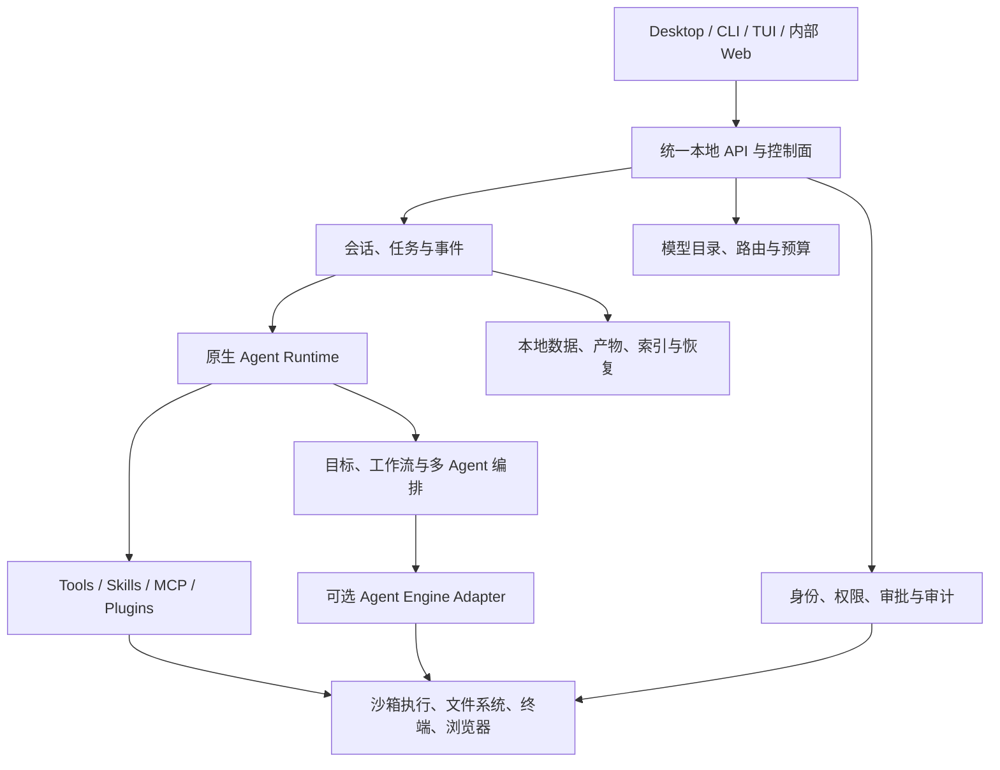

# 公司内部 Agent 产品总体方案

## 1. 产品结论

本项目不是只做一个简单编程助手，也不是同时拼装 OpenCode、DeepSeek Harness、Codex 三套产品，而是建设一个统一的公司内部 Agent 产品，并按能力逐层递进：

1. **A 层：成熟编程助手**——先把研发人员的日常代码工作做到稳定、好用、安全。
2. **B 层：复杂任务 Agent**——在 A 层之上增加长任务、多 Agent、后台执行、恢复和工作流。
3. **C 层：通用企业 Agent 平台**——复用前两层的运行时、权限、工具和审计能力，扩展到研发之外的业务场景。

最终目标是形成接近成熟商业 Codex 的产品体验：统一桌面入口、可靠的本地执行、复杂任务处理、可扩展工具体系、企业级权限与审计，而不是三个独立运行时的简单集合。

### 1.1 已确认方向

- 产品形态：Desktop 为主要入口，CLI/TUI 为专业入口，后续按需增加内部 Web 管理端。
- 产品路线：A → B → C，三层共享同一套会话、权限、模型、工具和数据基础设施。
- 语言范围：仅保留英文、简体中文、繁体中文。
- 部署原则：本地优先、公司可控；模型可接内部网关、云模型或本地模型。
- 安全原则：默认最小权限，高风险动作必须由系统策略或用户明确授权。
- 扩展原则：优先完善当前原生能力，外部 Agent 引擎只通过稳定接口按需接入。

### 1.2 明确不做

- 不在当前阶段把 DeepSeek Harness 和 Codex 完整打包进桌面应用。
- 不维护三套独立会话、权限弹窗、配置中心和更新机制。
- 不为了“功能多”提前建设没有真实业务场景的平台能力。
- 不以删除目录数量作为代码清理成果，避免删掉 B/C 阶段可复用的能力。

## 2. 产品分层

### 2.1 A 层：成熟编程助手

首批用户是公司研发人员，核心闭环为：

1. 打开本地项目并识别仓库规则。
2. 通过对话完成代码检索、分析和方案设计。
3. 在授权范围内修改文件、运行命令和调用工具。
4. 展示变更、命令结果、风险和待确认事项。
5. 完成构建、检查、代码审查和 Git 交付。
6. 保存并恢复会话、任务状态和工作现场。

A 层必须达到“日常可持续使用”，不是演示版。其重点是交互质量、执行可靠性、权限隔离、上下文准确性和安装升级体验。

### 2.2 B 层：复杂任务 Agent

在 A 层稳定后增加：

- 持久目标和长任务自动续跑。
- 任务拆解、依赖关系和阶段性验收。
- 多 Agent 并行研究、实现、验证和交叉审查。
- 前台、后台和定时任务统一管理。
- 中断、重试、恢复、取消和人工接管。
- 结构化输出、产物管理和最终报告。
- 模型、Token、时间、并发和工具调用预算。
- 可观察的执行时间线，不让多 Agent 成为黑盒。

B 层的目标不是无限启动 Agent，而是让复杂任务比单 Agent 更稳定、可控、可恢复。

### 2.3 C 层：通用企业 Agent 平台

在 B 层的任务运行时之上扩展：

- 可配置的 Agent 模板、角色、技能和工具包。
- 知识库、内部 API、数据库和办公系统连接器。
- 事件触发、审批流、定时计划和批量任务。
- 组织、工作区、角色、策略和数据边界。
- 管理后台、运行监控、审计查询和成本统计。
- SDK/API、远程 Worker 和受控的自动化执行环境。
- 面向运维、测试、数据分析、客服、文档等非研发场景的业务模板。

C 层仍然使用同一产品内核，不重新建设另一套 Agent 平台。

## 3. 产品架构



### 3.1 单一控制原则

为避免产品臃肿，必须保持以下单一事实源：

- 一个产品入口和统一设计系统。
- 一个会话与任务事件模型。
- 一个权限、审批和审计控制面。
- 一个模型目录与凭据管理入口。
- 一个工具注册与策略过滤入口。
- 一个安装、升级、迁移和诊断流程。
- 一个主 Agent Runtime；外部引擎只能作为可选 Worker，不能反向接管产品。

### 3.2 核心模块边界

| 模块 | 主要职责 |
| --- | --- |
| 产品界面 | 对话、任务、时间线、Diff、终端、审批、设置和诊断 |
| 会话与任务 | 持久事件、上下文、恢复、中断、重试、产物和状态投影 |
| Agent Runtime | 模型循环、工具调用、上下文管理、压缩和结果生成 |
| Orchestrator | 目标、拆解、依赖、并发、后台任务和工作流 |
| Capability Registry | Tools、Skills、MCP、插件和业务连接器 |
| Execution Plane | 本地沙箱、文件系统、进程、PTY、浏览器和远程 Worker |
| Enterprise Control | SSO、RBAC、策略、审计、模型白名单和数据治理 |
| Model Gateway | 内部网关、本地模型、外部 Provider、路由、限额和降级 |

## 4. 外部项目吸收策略

### 4.1 当前 OpenCode：产品主体

继续以当前项目作为主体，保留并强化其优势：

- Desktop、App、UI、CLI/TUI 和本地服务。
- 广泛的模型 Provider 支持。
- 会话 V2、事件、恢复、中断和 Revert 能力。
- Agent、Subagent、Skills、MCP、插件和 ACP。
- 文件变更、终端、项目管理和开发者交互体验。

优先修复其不足：缺少统一 OS 级执行沙箱、内部治理能力不完整、公共服务耦合较多、新旧架构仍在迁移。

### 4.2 DeepSeek Harness：学习编排设计，按需接入

当前只吸收设计思想，不直接引入完整运行时：

- Capability Seam 和插件组合方式。
- 持久目标、后台 Job、Workflow 和结构化输出。
- Subagent Provider 抽象与跨进程生命周期管理。
- 沙箱、审批和工具执行的失败关闭策略。

只有在 B 层基准任务证明原生编排无法满足需求，且自行完善成本明显更高时，才评估以下方式：

1. 固定版本的 Headless Sidecar。
2. 通过 ACP/SDK 接入，不共享内部数据库。
3. 只启用需要的编排能力，不打包完整 Web 产品。

### 4.3 OpenAI Codex：学习安全执行，作为可选专业引擎

当前重点吸收：

- OS 级沙箱与网络控制。
- 命令审批、提权、进程树回收和取消机制。
- Headless 执行和 App Server 协议设计。
- 编码、审查和修复任务的稳定执行经验。

只有出现以下情况时才接入 Codex：

- 原生编码任务质量长期达不到内部基准。
- 原生沙箱或执行器无法满足安全与跨平台要求。
- 某类高价值任务使用 Codex 的成功率明显更高。

接入时优先使用 `app-server` 进程协议，并作为可选组件安装；不把 Codex Rust 核心直接合并进当前 TypeScript/Bun 代码库。

### 4.4 吸收决策门槛

任何外部能力进入正式产品前都必须回答：

1. 解决了哪个已验证的问题。
2. 相比原生实现，成功率、性能或安全提升是否可测量。
3. 是否引入第二套会话、权限或配置事实源。
4. 是否支持固定版本、离线安装、升级和故障降级。
5. 是否满足许可证、SBOM、漏洞扫描和内部发布要求。

## 5. 分阶段路线图

### M0：代码基线与产品收敛

状态：**M0 基线、语言清理、模块审计、端点清单和上游同步已完成；待内部品牌与网关决策**。

目标：建立可持续二次开发的干净基线，不破坏未来 B/C 能力。

工作内容：

- 建立 Git 清理前基线和独立开发分支。
- 仅保留英文、简体中文、繁体中文。
- 完成模块依赖、资源引用和未来复用价值审计，详见 [M0 模块审计清单](./module-audit.md)。
- 建立外部域名、遥测、更新、安装和云服务端点清单，详见 [M0 外部端点清单](./external-endpoints.md)。
- 安装 Bun 工具链并完成现有类型检查和构建基线；根目录类型检查 30/30、Desktop 类型检查和开发构建均通过。核心包既有测试 1096 项通过；`packages/opencode` 既有测试 3391 项通过、22 项跳过、1 项 todo、4 项失败，失败分别涉及 SSE 超时测试的时序抖动和本机 npm 镜像配置，未修改测试断言。Bun 版本锁定仍待处理（当前环境 1.4.0，项目声明 1.3.14）。
- 确认内部品牌、包名、应用 ID、数据目录和更新通道。

退出条件：

- Desktop、CLI/TUI 和核心服务能够从干净环境构建。
- 所有删除项都有引用检查、恢复点和独立提交。
- 已形成“删除、隔离、保留、未来复用”四类模块清单。
- 既有验证结果已记录，环境相关失败必须在锁定 Bun 版本和统一包管理镜像后复核。

### M1：A 层可用版本

目标：完成内部研发人员可使用的编程助手闭环。

工作内容：

- 清除公共 OpenCode 品牌、链接和非必要服务依赖。
- 接入公司模型网关或受控 Provider 配置。
- 完善项目打开、上下文加载、Plan/Build、Diff、终端和审批体验。
- 保证会话保存、恢复、中断和失败提示可靠。
- 完善模型选择、Agent 选择、Skills、MCP 和项目规则管理。
- 建立内部安装包、签名、升级和回滚流程。

退出条件：

- 核心编码任务能够从需求到修改、验证和交付完整闭环。
- 无网络、模型不可用、工具失败和应用重启都有明确恢复路径。
- 不依赖未经批准的公共 OpenCode 服务。

### M2：A 层生产级加固

目标：达到可长期日常使用的成熟度，再进入大规模多 Agent。

工作内容：

- 建立真正的 OS 级 `read-only`、`workspace-write`、`danger-full-access` 沙箱模式。
- 将 Shell、文件写入、外部目录和网络访问纳入统一策略。
- 接入 SSO、角色权限、模型白名单和密钥安全存储。
- 建立操作审计、崩溃诊断、性能指标和隐私可控遥测。
- 完善进程回收、超时、取消、断电/崩溃恢复和数据库迁移。
- 建立内部真实任务评测集和版本回归机制。

退出条件：

- 未授权的文件、命令、网络和凭据访问能够被强制阻断。
- 应用异常退出后不会产生无法解释的任务状态或失控进程。
- 核心任务质量、稳定性和性能达到内部发布门槛。

### M3：B 层复杂任务能力

目标：可靠处理跨文件、跨模块、长时间运行的复杂任务。

工作内容：

- 持久 Goal、任务阶段、依赖和验收条件。
- 可配置的规划、探索、实现、测试、审查 Agent 角色。
- 前台/后台子 Agent、消息跟进、取消和结果汇总。
- 并行上限、深度上限、模型预算和 Token/时间预算。
- Workflow 定义、结构化结果、产物传递和人工检查点。
- 任务级恢复、幂等重试、失败降级和交叉审查。
- 在 UI 中呈现任务树、状态、成本、风险和最终报告。

退出条件：

- 复杂任务中断后可从持久状态恢复，而不是重新开始。
- 多 Agent 相比单 Agent 在内部复杂任务集上产生可测量收益。
- 权限不会因委派、嵌套或后台执行被绕过。

### M4：C 层通用企业平台

目标：将成熟 Agent Runtime 扩展到非研发业务场景。

工作内容：

- Agent、Skill、Tool、Workflow 模板管理。
- 内部知识库、API、数据库和办公系统连接器。
- 事件触发、定时任务、人工审批和批量执行。
- 组织、工作区、RBAC、策略继承和数据隔离。
- 内部 Web 管理端、任务运营、审计检索和成本分析。
- SDK/API、受控远程 Worker 和集中策略下发。
- 先选一个真实非研发场景试点，再扩展场景目录。

退出条件：

- 至少一个非研发业务场景完成端到端试点并产生明确收益。
- 研发 Agent 与业务 Agent 共享基础设施但保持权限和数据隔离。
- 管理员能够控制谁可以使用哪些模型、数据、工具和执行环境。

### M5：商业级产品成熟度

该阶段不是最后一次开发，而是贯穿 M1-M4 的持续要求：

- 稳定发布通道、灰度、回滚和长期数据迁移。
- 安装诊断、自恢复、兼容性检测和问题反馈闭环。
- 可访问性、国际化、性能和大规模历史数据体验。
- 安全响应、依赖漏洞、许可证、SBOM 和供应链治理。
- 产品文档、管理员手册、用户引导和内部支持流程。
- 通过真实任务基准而不是功能数量衡量版本提升。

## 6. 代码清理策略调整

产品方向已经扩展到 B/C，因此原“公共模块直接删除”策略调整为“先分类、后处理”。

### 6.1 可以清理

- 非英文、简体中文、繁体中文的语言资源。
- 与内部产品无关且无构建依赖的营销图片、社区入口和公开宣传内容。
- 已被内部实现替代的公共安装、遥测、反馈和更新逻辑。
- 经引用检查确认不参与产品、开发、构建或未来复用的产物。

### 6.2 先隔离或停止打包，不立即删除

| 模块 | 原因 |
| --- | --- |
| `packages/web` | 未来可能作为内部 Web 入口或管理端基础 |
| `packages/docs` | 未来可能承载内部用户与管理员文档 |
| `packages/console` | C 层管理后台和策略配置可能复用 |
| `packages/stats` | 可评估复用其统计展示思路，公共统计业务本身不保留 |
| `packages/storybook` | 可能继续服务统一设计系统和组件开发 |
| `packages/slack` | C 层业务连接器候选，不进入 A 层默认包 |
| `infra/`、`sst.config.ts` | 等内部部署架构确定后再替换或删除 |
| `artifacts/` | 先确认构建、发布、品牌资源引用后再处理 |

### 6.3 必须保留

- `packages/desktop`、`packages/app`、`packages/ui`、`packages/session-ui`。
- `packages/opencode`、`packages/core`、`packages/server`。
- `packages/schema`、`packages/protocol`、`packages/client`。
- `packages/cli`、`packages/tui`。
- 当前运行所需的 SDK、插件、数据库、生成代码和基础能力包。
- `AGENTS.md`、测试资源、迁移、生成脚本、补丁、锁文件和许可证材料。

## 7. 安全与企业治理

### 7.1 执行安全

- 默认使用 `workspace-write`，只允许写入当前工作区和受控临时目录。
- 读取敏感文件、访问外部目录、开放网络和提权执行必须单独授权。
- Shell 和文件工具使用同一策略与同一工作区根，避免策略不一致。
- 后台 Agent、外部 Worker 和子 Agent 不得继承超过父任务的权限。
- 无 UI 或无人值守环境遇到审批时默认失败关闭。

### 7.2 身份与数据

- 接入公司 SSO，支持管理员、普通用户、审计员等角色。
- 密钥使用系统凭据存储或公司密钥服务，不进入仓库、普通配置和日志。
- 明确提示词、会话、附件、工具输出、审计和缓存的保存周期。
- 模型请求通过内部网关实施 Provider、模型、地域和数据策略。
- 对导出、共享、远程工具、MCP 和业务连接器实施管理员策略。

### 7.3 供应链

- 内部安装包必须签名并支持来源验证。
- 生成第三方依赖清单、许可证报告和 SBOM。
- 固定关键 Sidecar、MCP Server 和插件版本。
- 插件、Skill 和连接器进入生产前必须经过审批、扫描和允许列表。

## 8. 模型与 Agent 策略

- 不把产品绑定到单一模型厂商。
- 通过内部模型目录定义可用模型、能力、上下文、价格和数据等级。
- 允许为规划、探索、实现、审查和摘要选择不同模型。
- 支持公司网关、本地模型和批准的外部 Provider。
- 模型切换不能改变权限边界，也不能绕过工具策略。
- 多 Agent 必须有预算控制，不能通过并发无限放大成本。

## 9. 评测与发布门槛

建立三类真实任务集：

- A 类：代码理解、小型修改、Bug 修复、构建验证、代码审查。
- B 类：跨模块功能、迁移、复杂排查、长任务恢复、多 Agent 协作。
- C 类：内部知识问答、数据处理、审批自动化和跨系统业务流程。

每个版本至少评估：

- 任务完成质量和一次通过率。
- 错误修改、越权操作和高风险误执行。
- 中断恢复、重试、取消和进程清理。
- 首次响应、总耗时、Token、模型和基础设施成本。
- 用户介入次数、审批质量和最终结果可解释性。
- 升级、回滚、数据迁移和跨平台兼容性。

具体数值门槛在 M0 建立基线后确定，避免在没有真实样本时虚构指标。

## 10. Fork 与上游管理策略

### 10.1 仓库类型

当前采用**个人 GitHub 公开 Fork**，仓库为：

```text
https://github.com/yiyaxy/opencode
```

上游是 `anomalyco/opencode`。公共 Fork 会保持公开，所有代码、提交、Issue、PR、Actions 日志和 Release 都可能被查看，因此公司内部凭据、域名、SSO 配置和部署信息必须与公开代码分离。[GitHub Fork 可见性说明](https://docs.github.com/en/pull-requests/reference/forks)

### 10.2 目标远程结构

| Remote | 地址 | 用途 | 推送策略 |
| --- | --- | --- | --- |
| `origin` | `https://github.com/yiyaxy/opencode.git` | 个人公开 Fork、开发和发布 | 允许推送 |
| `upstream` | `https://github.com/anomalyco/opencode.git` | 获取上游修复和新功能 | 只拉取 |

当前本地远程已经调整为上述结构；迁移分支已推送到 Fork，尚未覆盖 Fork 的 `dev`。

### 10.3 当前仓库风险

当前本地 Git 历史从清理前基线 `ac7c164` 开始，没有继承官方上游提交历史。直接把 `internal-cleanup` 强推到 Fork 会破坏标准 Fork 的历史关系，后续同步上游会产生无关历史和大范围冲突。

因此，先从 Fork 的 `dev` 历史创建迁移分支，再重新应用当前语言清理和 Plan 变更。当前独立历史只作为迁移备份，不作为公开 Fork 的长期主线。

### 10.4 历史迁移步骤

1. 保留当前本地仓库和 `internal-cleanup` 分支作为备份。
2. 从 `origin/dev` 或匹配的 `upstream/dev` 创建新的迁移工作区。
3. 定位与当前代码版本最接近的上游基点；当前项目版本为 `1.18.23`，可优先核对对应 Tag。
4. 将三语言清理、项目 Plan 和后续二开变更按逻辑提交重新应用。
5. 校验文件树、删除清单、语言配置和文档与当前工作区一致。
6. 在迁移分支完成类型检查、既有测试、构建和静态安全检查。
7. 通过 PR 合并到 Fork 的 `dev`，再设置 `dev` 为默认分支。

当前同步记录：`upstream-sync` 已从 `fork-migration` 合并 `upstream/dev`，合并提交为 `b58fb5c21`；60 个语言文件冲突均按既定删除策略解决。Desktop 开发构建已改为优先使用 `OPENCODE_DESKTOP_CLI_PATH` 或当前源码构建的 CLI，不再依赖未发布的上游 CLI 版本。同步分支已推送至 Fork，且当前分支与 `origin/upstream-sync` 一致；Fork 内部 PR [#1](https://github.com/yiyaxy/opencode/pull/1) 已创建，目标为 `yiyaxy/opencode:dev`，GitHub 检查正在运行。

迁移会产生新的提交哈希；以共同上游基点、文件内容和可审查的逻辑提交为准，不强行保留当前临时提交哈希。

### 10.5 分支与同步策略

- `dev`：个人 Fork 的主开发分支，遵循上游默认分支。
- `internal-cleanup`：迁移前本地备份分支，确认迁移完成后再归档。
- `upstream-sync`：每次同步官方更新的临时分支。
- 功能分支：遵循最多三个短词、使用连字符且不带类型前缀的现有规则。
- 发布使用受保护 Tag 或发布分支，不直接从功能分支发布。

上游同步流程：

1. `git fetch upstream --tags --prune`。
2. 从最新 Fork `dev` 创建 `upstream-sync`。
3. 将指定的 `upstream/dev` 合并到同步分支。
4. 处理品牌、端点、权限、数据结构和已删除模块冲突。
5. 运行受影响 package 的类型检查、既有测试、构建和产品回归。
6. 通过 PR 合并回 Fork 的 `dev`，记录上游基点、冲突和保留的内部差异。

不得对 Fork 使用无审查的 `git push --mirror`，也不得强制覆盖 `dev`。

### 10.6 公开仓库安全要求

- 公开仓库只提交通用产品代码和占位配置。
- 公司模型网关、SSO、服务器地址、内部域名和部署密钥放在独立私有配置或部署仓库。
- `.env.example` 只能放占位值，不能包含真实凭据。
- 上游 GitHub Actions 和第三方 Action 启用前必须审计。
- 保留 OpenCode MIT 许可证、上游版权信息和第三方依赖声明。
- 公开 Issue、Action 日志和 Release 中不得出现内部业务数据。

### 10.7 已完成与待办

- 已完成：Fork `yiyaxy/opencode` 已创建。
- 已完成：本地 `origin` 已指向个人 Fork。
- 已完成：本地 `upstream` 已指向官方仓库。
- 已完成：基于 Fork `dev` 的 `fork-migration` 已推送。
- 已完成：当前语言清理和产品 Plan 已迁移到标准 Fork 历史。
- 已完成：`upstream-sync` 已同步上游 `dev`，并保留三语言删除策略。
- 已完成：`upstream-sync` 已推送到 Fork，推送地址为 `origin/upstream-sync`。
- 待办：审核并合并 Fork 内部 PR [#1](https://github.com/yiyaxy/opencode/pull/1) 到 `dev`。
- 待办：开启分支保护、Dependabot、Secret Scanning 和必要的代码扫描。

## 11. 当前实施状态

| 项目 | 状态 | 说明 |
| --- | --- | --- |
| 产品路线 A → B → C | 已确认 | 一个产品分层递进，不同时拼装三个产品 |
| Git 清理前基线 | 已完成 | 基线提交：`ac7c164` |
| 工作分支 | 已完成 | 当前分支：`upstream-sync`；`fork-migration` 保留为已推送迁移分支，`internal-cleanup` 保留为本地备份 |
| Fork 与远程 | 已完成 | `origin` 指向 `https://github.com/yiyaxy/opencode.git`；迁移分支已推送，尚未覆盖 Fork `dev` |
| 三语言清理 | 已完成 | 迁移提交：`68819552`，删除 766 个无关语言文件 |
| 静态校验 | 已通过 | 已完成差异、语言目录、配置和相关语法检查 |
| Bun 类型检查、构建和测试 | 部分完成 | 上游同步后根级 `bun typecheck`（30/30 任务）、13 个基础包类型检查、App/服务端构建和当前平台 CLI/单体构建均通过；核心包既有测试 1096 项通过；`packages/opencode` 3391 项通过、22 项跳过、1 项 todo、4 项失败（SSE 超时测试时序、本机 npm 镜像）；未新增测试。Bun 仍为 1.4.0、项目声明 1.3.14 |
| Desktop 开发构建 | 已通过 | `bun run build` 已通过；开发渠道优先使用本地/源码 CLI，避免下载未发布的 `0.0.0-next-16350` |
| 模块复用审计 | 已完成 | 清单见 [module-audit.md](./module-audit.md)，暂无新增目录级删除项 |
| 外部端点审计 | 已完成 | 清单见 [external-endpoints.md](./external-endpoints.md)，未修改生产端点或敏感配置 |
| 上游同步 | 已完成 | `upstream/dev` 当前为 `10765ff2`；本地已解决 60 个语言文件 modify/delete 冲突，同步分支已推送，Fork 内部 PR #1 已创建，待合并到 `dev` |
| A 层内部化 | 计划中 | 外部端点、品牌、模型网关、安装更新待处理 |
| A 层生产加固 | 计划中 | 沙箱、SSO、审计、恢复和评测待建设 |
| B 层复杂任务 | 规划中 | 等 A 层达到发布门槛后实施 |
| C 层通用平台 | 方向确认 | 等 B 层稳定并选定真实业务试点后实施 |

## 12. 待确认但不阻塞 M0 的决策

- 公司内部身份系统与 SSO 协议。
- 模型网关、允许的外部 Provider 和本地模型方案。
- 首版支持的操作系统与内部发布渠道。
- 会话、附件、审计和遥测的数据保存周期。
- C 层第一个非研发试点场景。
- 是否需要集中服务端，以及本地与服务端的职责边界。

## 13. 下一步

1. 审核并通过 PR #1 将已推送的 `upstream-sync` 合并到 Fork 的 `dev`，并保留 `internal-cleanup` 作为迁移备份。
2. 锁定 Bun 1.3.14 或确认公司统一使用的兼容版本，复核已记录的既有测试失败。
3. 确认内部品牌、包名、应用 ID、数据目录、安装源和更新通道。
4. 确认公司模型网关、允许的 Provider、模型目录同步方式和离线缓存策略。
5. 按 [external-endpoints.md](./external-endpoints.md) 逐项制定端点替换或禁用变更，先处理模型、安装更新、分享和公共 Referer。
6. 进入 M1，先交付 Desktop/Web/CLI 共用模型配置和完整、可靠、安全的内部编程助手闭环。
